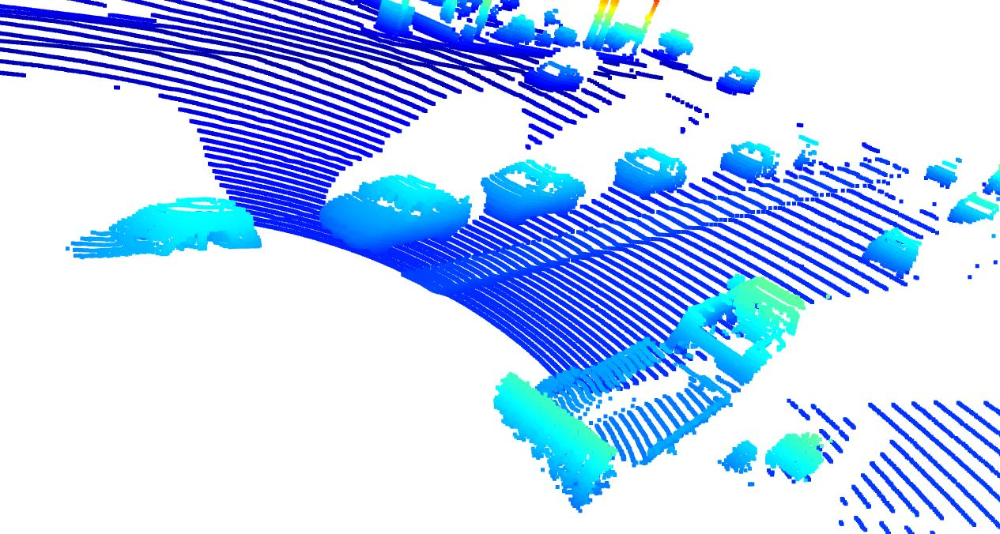
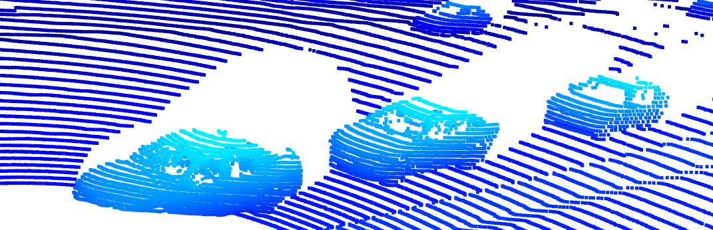
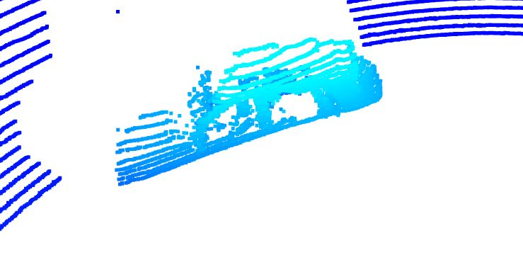
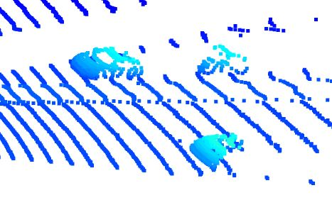
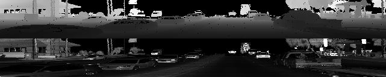
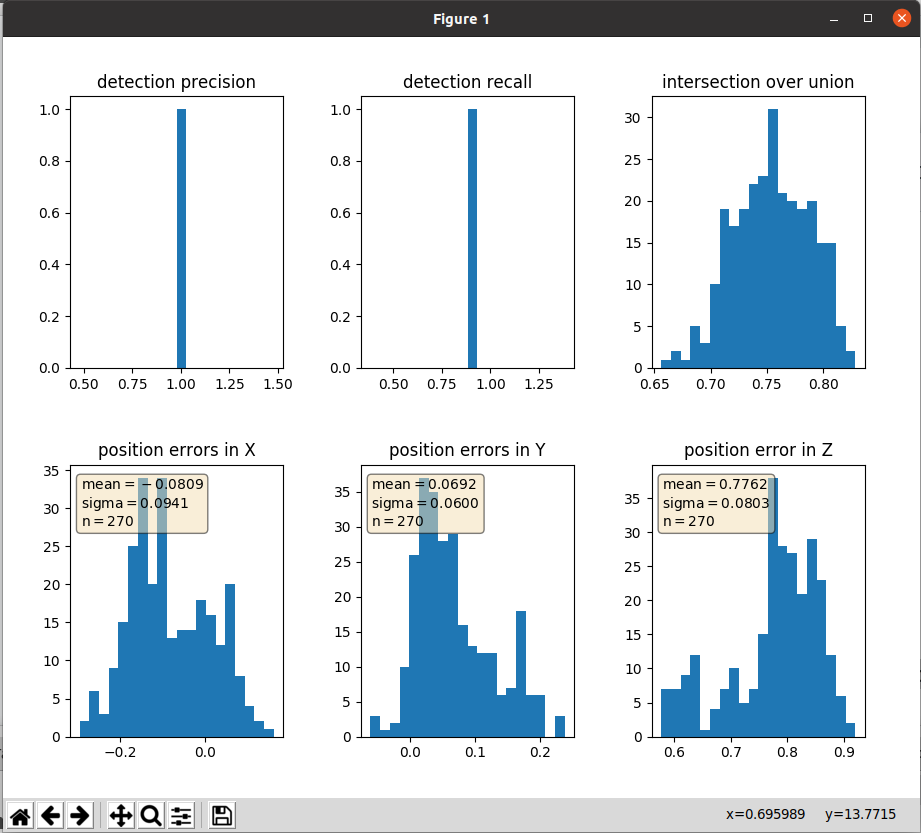
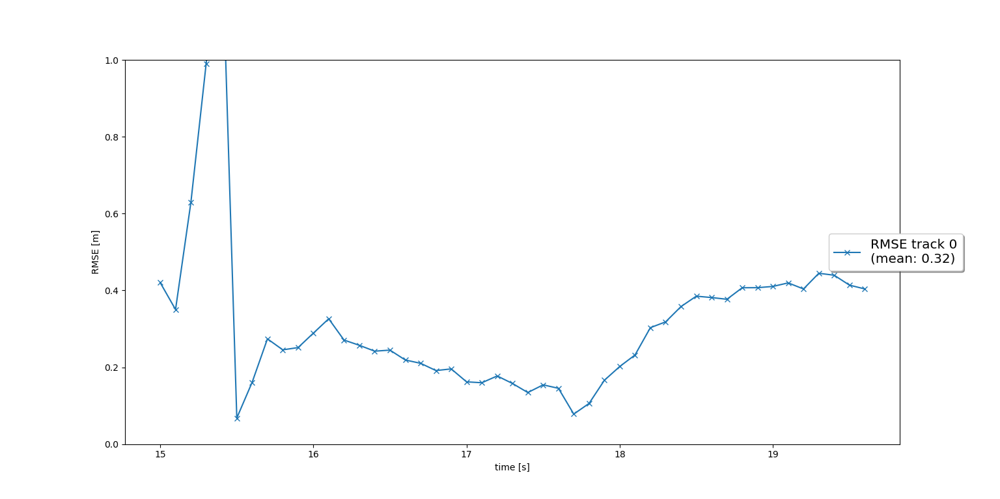
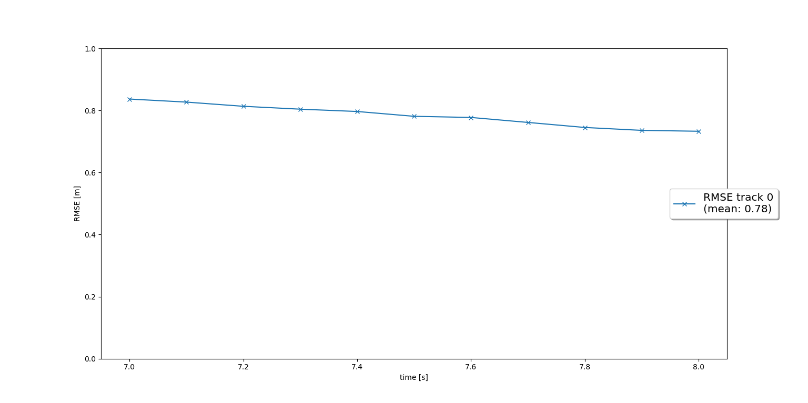
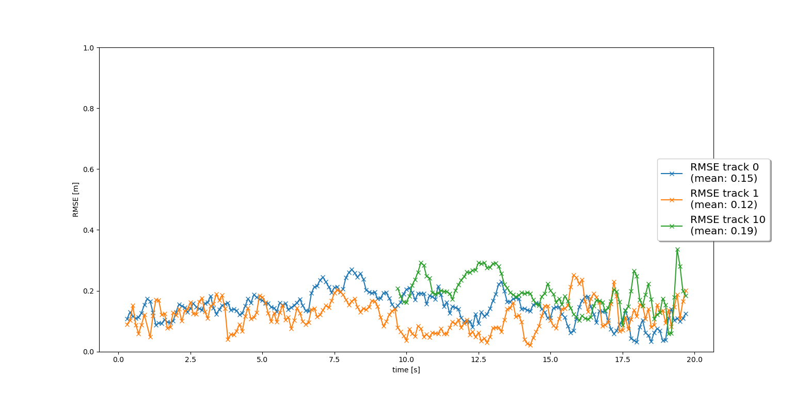
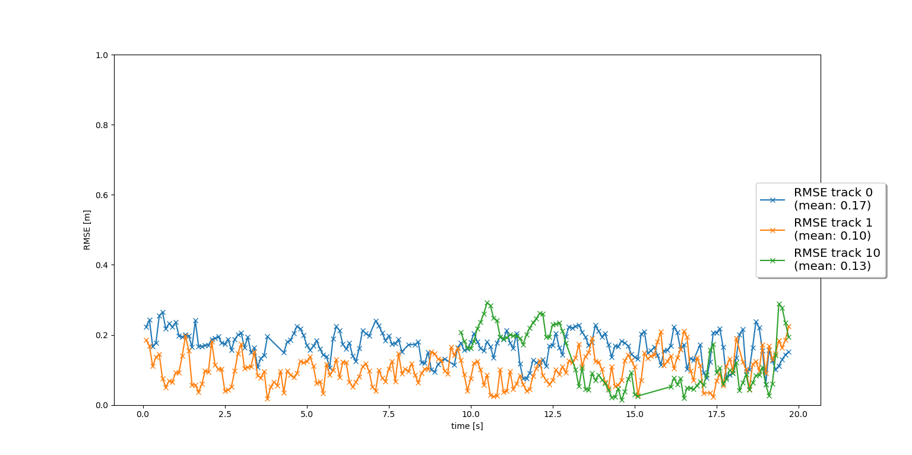

# Writeup: Mid-Term Project: 3D Object Detection

### Find and display 10 examples of vehicles with varying degrees of visibility in the point-cloud.

#### High Visibility vehicle example:

#### Medium Visibility vehicle example:

#### Low Visibility vehicle example:

### Identify vehicle features that appear as a stable feature on most vehicles (e.g. rear-bumper, tail-lights) and describe them briefly. Also, use the range image viewer from the last example to underpin your findings using the lidar intensity channel.
As we can see from the above snapshots, vehicle chassis is the most identifiable feature. Bumpers (Front/Rear), tail lights and head lights are the stable features depending on the direction and position of the car.

### Precision and Recall Graph

# Writeup: Track 3D-Objects Over Time

Please use this starter template to answer the following questions:

### 1. Write a short recap of the four tracking steps and what you implemented there (filter, track management, association, camera fusion). Which results did you achieve? Which part of the project was most difficult for you to complete, and why?
1. Filtering: Used Extended Kalman Filter(EKF) for tracking of objects and a linear measurement model for Lidar detections and a non-linear measurement function for Camera detections. Used sensor calibration information to correctly transform between vehicle and sensor coordinate systems. For Prediction step, constant velocity model is used.
2. Track management: Initialized new track from unassigned measurements and calculated track score based on the number of correct detections in a fixed window of past frames, taking into consideration sensor field-of-views. Handled 3 track states (init, tentative, confirmed) and deleted tracks based on hard-coded thresholds on track scores and for too large covariance values.
3. Association: Used the Mahalanobis distance as it uses L2 distance of track means & covariances and measurement means & covariances.
4. Camera fusion: Used a non-linear function to transform Kalman Filter state into camera and then image space.

The resulting system correctly tracks all valid and clearly visible objects in the selected sample sequences with RMSE below the expected.
No major difficulties were encountered.

### 2. Do you see any benefits in camera-lidar fusion compared to lidar-only tracking (in theory and in your concrete results)? 
Using both sensors provide more robust results as each sensor as its own advantage and disadvantage in particular senarios.

### 3. Which challenges will a sensor fusion system face in real-life scenarios? Did you see any of these challenges in the project?
If there is a mismatch in object detection between the sensors, a decision has to be made to select one of them as the truth value.

### 4. Can you think of ways to improve your tracking results in the future?
We can use other sensors attached to the car, to have a 360 field of view.

#### RMSE for Step 1:

#### RMSE for Step 2:

#### RMSE for Step 3:

#### RMSE for Step 4:

